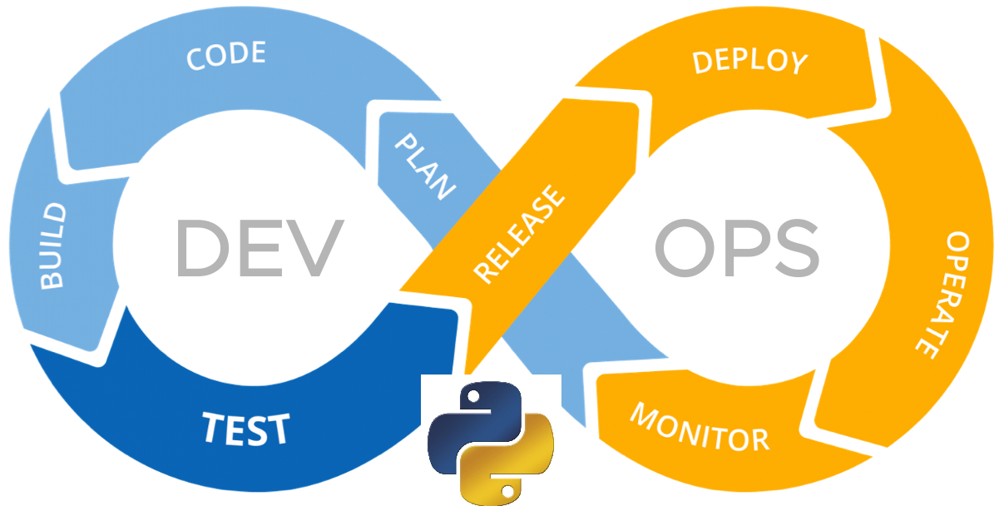

# Cloud Platform Engineering



---

## How to use this repository

### How to create/update the python `requirements.txt` file

```bash
pip install pipreqs
pipreqs $(pwd) --force

# output
INFO: Successfully saved requirements file in /home/user/cloud-platform-engineering/src/python/requirements.txt
```

Please note that pipreqs does not consider the packages installed in your environment, it only considers the packages imported in your Python files. If you want to generate a requirements.txt file based on the packages installed in your environment, you should use `pip freeze`.

Why not `pip freeze`?

- `pip freeze` only saves the packages that are installed with pip install in your environment.

- `pip freeze` saves all packages in the environment including those that you don’t use in your current project (if you don’t have virtualenv),

- Sometimes you just need to create `requirements.txt` for a new project without installing modules.

### References

- [pipreqs](https://pypi.org/project/pipreqs/)

### leveraging a 'library' approach for code resue

Creating a library in Python involves structuring your code in a specific way, and using a `setup.py` script to allow the code to be installed and imported. 

Here's how are are doing that here in this repository:

**Step 1: Create a new directory for your library**

First, create a new directory for your library files:

```shell
pwd /home/user/cloud-plaform-engineering/src/python/
mkdir githubauthlib
cd githubauthlib
```

**Step 2: Create the library file**

Inside the `githubauthlib` directory, we have created `github_auth.py` and added a bnlock of reusable code to handle local GitHub credentials.

This is what that looks like:

```python
import subprocess
import platform

def get_github_token():
    if platform.system() == "Darwin":
        try:
            output = subprocess.check_output(["git", "credential-osxkeychain", "get"], input="protocol=https\nhost=github.com\n", universal_newlines=True, stderr=subprocess.DEVNULL)
            access_token = output.strip().split()[0].split('=')[1]
            return access_token
        except subprocess.CalledProcessError:
            print("GitHub access token not found in osxkeychain.")
            return None
    elif platform.system() == "Windows":
        try:
            output = subprocess.check_output(["git", "config", "--get", "credential.helper"], universal_newlines=True, stderr=subprocess.DEVNULL)
            if output.strip() == "manager":
                output = subprocess.check_output(["git", "credential", "fill"], input="url=https://github.com", universal_newlines=True, stderr=subprocess.DEVNULL)
                credentials = {}
                for line in output.strip().split("\n"):
                    key, value = line.split("=")
                    credentials[key] = value.strip()
                access_token = credentials.get("password")
                return access_token
            print("GitHub access token not found in Windows Credential Manager.")
            return None
        except subprocess.CalledProcessError:
            print("Error retrieving GitHub credential helper.")
            return None
    else:
        print("Unsupported operating system.")
        return None
```

**Step 3: Create the `__init__.py` file**

You'll now need an `__init__.py` file in the same directory, which tells Python to treat this directory as a package. __NOTE__This file can be empty, but let's import the function there to make it more easily accessible:

In `__init__.py`, write:

```python
from .github_auth import get_github_token
```

**Step 4: Create `setup.py`**

Next, create a `setup.py` script, again in the same directory, which is used to describe your module distribution to the Distutils, so that the various commands that operate on your modules do the right thing.

We are using a very basic example in `setup.py`:

```python
from setuptools import setup, find_packages

setup(
    name="githubauthlib",
    version="0.1",
    packages=find_packages(),
)
```

**Step 5: Install the library**

Now you can install your library. If you're in the same directory as `setup.py`, you can simply execute:

```shell
pip install .
```

This is the expected output:

```shell
Processing /home/user/cloud-platofrm-engineering/src/python/githubauthlib
  Preparing metadata (setup.py) ... done
Building wheels for collected packages: githubauthlib
  Building wheel for githubauthlib (setup.py) ... done
  Created wheel for githubauthlib: filename=githubauthlib-0.1-py3-none-any.whl size=888 sha256=f7a38db0e283b367b6b5968e93167600238549e58a606eff82ea46ecc3fe4fda
  Stored in directory: /private/var/folders/m6/tqrb8gq551q5y32zqmkj1vbw0000gr/T/pip-ephem-wheel-cache-3njs4y6j/wheels/1c/3f/2b/dc2903532656dc56af4a2dbed83efc750abbc8fc31de917c76
Successfully built githubauthlib
Installing collected packages: githubauthlib
Successfully installed githubauthlib-0.1
```

Now, in any Python script on your system, you can use the library as follows:

```python
from githubauthlib import get_github_token

## call it in the scipt like any other Python finction

# example
token = get_github_token()

if token:
    print(f"Got GitHub token: {token}")
else:
    print("Could not get GitHub token")

```

Please remember to document your library and also include unit tests where possible. This would be very beneficial if you plan to distribute it or work with other teams...
