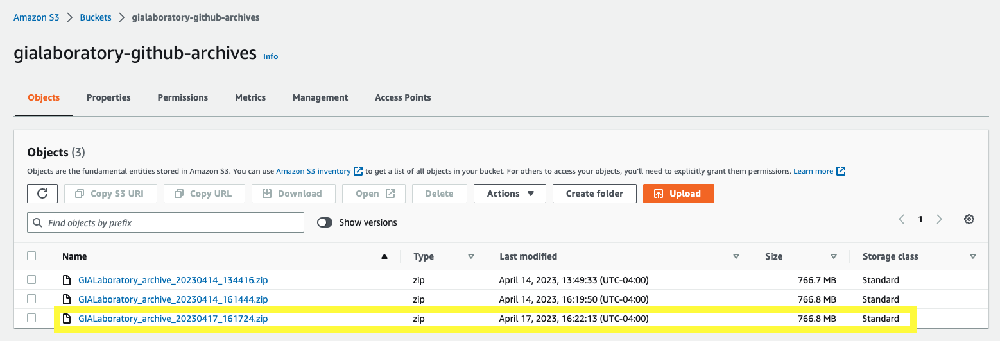

# Python for GitHub

## Scripts for GitHub organization automation

### Available Scripts

| Script | Description |
|--------|-------------|
| `export_org_archive_to_s3.py` | Archive all repos in a GitHub org and upload to S3 |
| `classify_github_repo_topics.py` | Classify and tag repos by topic |
| `export_all_dependabot_alerts.py` | Export Dependabot alerts across all repos |
| `export_topic_dependabot_alerts.py` | Export Dependabot alerts filtered by topic |
| `list_repos_for_user.py` | List all repos for a specific user |
| `org_user_list.py` | List all users in a GitHub organization |
| `org_user_profile.py` | Get profile details for an org user |
| `org_user_with_no_repos.py` | Find org users with no repositories |
| `public_list.py` | List public repositories for a user |

### Example Usage

#### Login for programmatic access

```bash
aws sso login --profile myorg-training
```

#### Check script options

```bash
python export_org_archive_to_s3.py -h
usage: export_org_archive_to_s3.py [-h] -p PROFILE

Create an Organization Archive from GitHub.com and export to AWS S3.

options:
  -h, --help            show this help message and exit
  -p PROFILE, --profile PROFILE
                        AWS profile name for SSO login
```

#### Run the archive script

```bash
python export_org_archive_to_s3.py -p myorg-training
```

#### Sample Output

```bash
Downloading: 238B [00:00, 832B/s]
Downloading: 7.00B [00:00, 163B/s]
...

Total repos in org: 176
Total repos in archive: 176

Uploading myorg_archive_20230417_161724.zip to S3 myorg-github-archives bucket...
Upload Successful: myorg_archive_20230417_161724.zip
Removing local file...
```

#### Confirm the new archive is in S3



### Testing

```bash
coverage run --source=. -m unittest discover tests
coverage report
coverage xml
```
