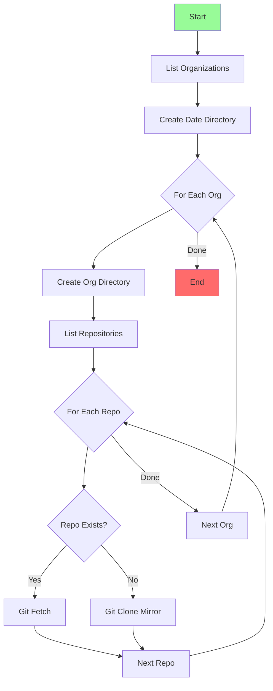

# GitHub Enterprise Backup Tool

## Core Functionality

1. **List Organizations**
   - Uses `gh api user/orgs` to get all accessible organizations

2. **For Each Organization:**
   - Creates dated directory structure: `github_backup/YYYYMMDD/org_name/`
   - Uses `gh api orgs/{org}/repos` to list all repositories

3. **For Each Repository:**
   - If new: `git clone --mirror {repo_url}`
   - If exists: `git fetch --all`

## Process Flow



## Simple Usage

```bash
# Authenticate with GitHub Enterprise
gh auth login --hostname github.example.com

# Run backup
python3 ghe_backup.py
```

## Overview

A Python-based utility for creating full backups of all repositories from GitHub Enterprise Server (github.example.com). The tool uses concurrent processing and git mirror functionality to efficiently backup all repositories across all organizations.

## Prerequisites

- Python 3.11+
- Git client
- Access to github.example.com
- GitHub Enterprise personal access token
- Required Python packages:

  ```bash
  pip install -r requirements.txt
  ```

## Token Setup

1. Generate a Personal Access Token:

   - Login to github.example.com
   - Go to Settings > Developer settings > Personal access tokens
   - Generate new token with scopes:
     - `repo` (all)
     - `read:org`

2. Set the environment variable:

   ```bash
   export GITHUB_TOKEN="your-token-here"
   ```

## Usage

```bash
# Create and activate virtual environment
python3 -m venv .venv
source .venv/bin/activate

# Install dependencies
pip install -r requirements.txt

# Check the script
pylint --rcfile=.pylintrc ghe_backup.py

# Run the backup
python3 ghe_backup.py
```

## Backup Structure

```bash
github_backup/
└── YYYYMMDD/           # Date-stamped directory
    ├── org1/           # Organization directory
    │   ├── repo1.git/  # Git mirror repository
    │   └── repo2.git/
    └── org2/
        ├── repo3.git/
        └── repo4.git/
```

## Features

- **Concurrent Processing**: Uses Python's ThreadPoolExecutor
- **Incremental Updates**: Updates existing backups efficiently
- **Error Handling**: Comprehensive error capture and reporting
- **Progress Logging**: Detailed status updates
- **Organization Structure**: Maintains logical backup organization

## Error Handling

The script handles several error conditions:

- Missing GitHub token
- Network connectivity issues
- Invalid repositories
- Permission issues
- Existing backup conflicts

## Logging

All operations are logged with timestamps:

```bash
YYYY-MM-DD HH:MM:SS,mmm - INFO - 🔍 Starting backup to: /path/to/backup
YYYY-MM-DD HH:MM:SS,mmm - INFO - 📂 Processing organization: org-name
YYYY-MM-DD HH:MM:SS,mmm - INFO - ✅ Successfully backed up org/repo
```

## Development

Run linting checks:

```bash
pylint --rcfile=.pylintrc ghe_backup.py
```

## Support

For issues or questions, contact DevSecOps team:

- Email: devsecops@example.com
- Teams: Cloud Platform Engineering Channel

---

Copyright (c) 2024 MyOrg. All rights reserved.
