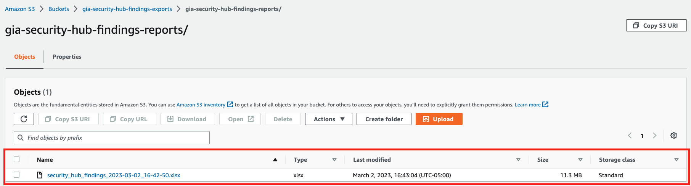

# How to use these scripts

The main script is `export-security-hub-findings.py` which allows you to choose your export location, either local or in S3. `local-export-security-hub-findings.py` is the original script and is just hanging around for posterity.

## manual

clone this repo

```bash
git clone https://github.com/theusc6/myorg-devsecops.git
```

move into the correct directory

```bash
cd myorg-devsecops/secops/SecurityHub/Python/manual
```

login with the correct AWS profile

```bash
aws sso login --profile security-tooling
```

expected output from the login

```bash
NY-IT-MAC-01:manual user$ !439
aws sso login --profile security-tooling
Attempting to automatically open the SSO authorization page in your default browser.
If the browser does not open or you wish to use a different device to authorize this request, open the following URL:

https://device.sso.us-west-2.amazonaws.com/

Then enter the code:

FFFF-VVVV
Successfully logged into Start URL: https://d-9267738feb.awsapps.com/start#/
```

check the script options

```bash
NY-IT-MAC-01:manual user$ python3 export-security-hub-findings.py 
usage: export-security-hub-findings.py [-h] -p PROFILE -e {local,s3} [-s {INFORMATIONAL,LOW,MEDIUM,HIGH,CRITICAL}]
export-security-hub-findings.py: error: the following arguments are required: -p/--profile, -e/--export
```

execute the script

```bash
python3 export-security-hub-findings.py -p security-tooling -e s3
```

**NOTE:** at present, it takes about 15 minutes...

expected output

```bash
NY-IT-MAC-01:manual user$ python3 export-security-hub-findings.py -p security-tooling -e s3
Exported findings to s3://myorg-security-hub-findings-exports/myorg-security-hub-findings-reports/security_hub_findings_2023-03-02_16-42-50.xlsx
Elapsed time: 15.37 minutes
```

Verify that the newly exported file is in the S3 bucket



## Notes

Although I have accounted for the lack of an S3 bucket, what it will create using that option is **NOT** at all what we want as a default.  The `/infra/s3-create-bucket.py` script is far more detailed in terms of what you want as an S3 bucket. Perhaps a futher iteration will actually call in that script if the bucket creation is required, but for now, just know that you **should** create the bucket before running the export script.
