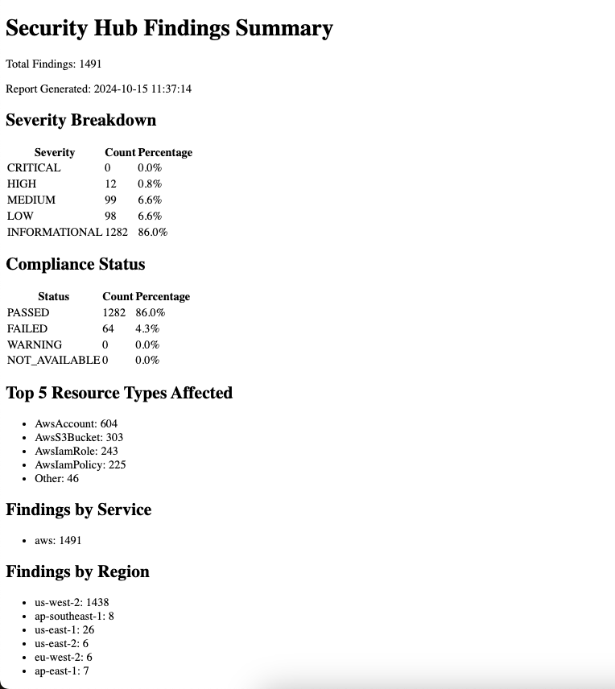

# Security Hub Findings Report Generator

This script retrieves security findings from AWS Security Hub, aggregates them, and generates a simple HTML report summarizing the findings.

## Features

* Retrieves all findings from Security Hub.
* Aggregates findings by severity, compliance status, resource type, service, and region.
* Generates an HTML report with tables and lists to display the aggregated data.
* Includes a timestamp in the report filename and content.

## Requirements

* Python 3.6 or later
* Boto3 (AWS SDK for Python)
* pdfkit
* An AWS profile with permissions to read AWS SecurityHub findings

## Usage

1. **Install Boto3:**

```bash
pip install boto3
```

Configure AWS Credentials:

Ensure that you have configured your AWS credentials with a profile that has permissions to read Security Hub findings. You can configure your credentials using the AWS CLI:

```bash
aws configure --profile <profile_name>
```

login to the `myorg-master` AWS account using SSO credentials:

```bash
aws sso login --profile myorg-master
```

Review the options:

```Bash
$ python3 security_hub_findings_pdf_pdf.py -h
usage: security_hub_findings_pdf_pdf.py [-h] --profile PROFILE [--region REGION]

Retrieve and aggregate Security Hub findings.

options:
  -h, --help         show this help message and exit
  --profile PROFILE  AWS profile name
  --region REGION    AWS region (default: us-west-2)
```

Run the script:

```bash
python3 security_hub_findings_pdf.py --profile <profile_name> [--region <region_name>]
```

`--profile:` The name of the AWS profile to use. (required)

`--region:` The AWS region where Security Hub is configured. Defaults to us-west-2.

## Output

The script will generate a PDF report file named security_hub_report_[timestamp].html in the same directory where the script is executed. The report contains the following information:

* **Total Findings:** The total number of findings retrieved from Security Hub.
* **Severity Breakdown:** A table showing the count and percentage of findings for each severity level (CRITICAL, HIGH, MEDIUM, LOW, INFORMATIONAL).
* **Compliance Status:** A table showing the count and percentage of findings for each compliance status (PASSED, FAILED, WARNING, NOT_AVAILABLE).
* **Top 5 Resource Types Affected:** A list of the top 5 resource types affected by the findings.
* **Findings by Service:** A list of the number of findings originating from each AWS service.
* **Findings by Region:** A list of the number of findings per AWS region.

## Example

```bash
python3 security_hub_findings_pdf.py --profile myorg-master --region us-west-2
```

This will generate a report named security_hub_report_20241016_152030.html (with the current timestamp) containing the aggregated Security Hub findings from the us-west-2 region (default home region) using the `myorg-master` profile.



## License

This script is released under the MIT License.
