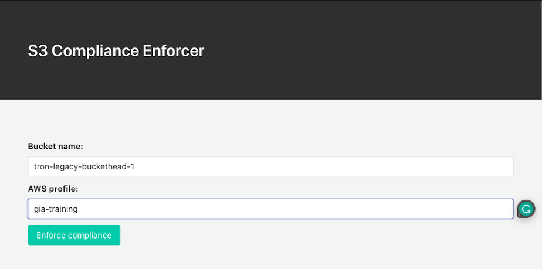
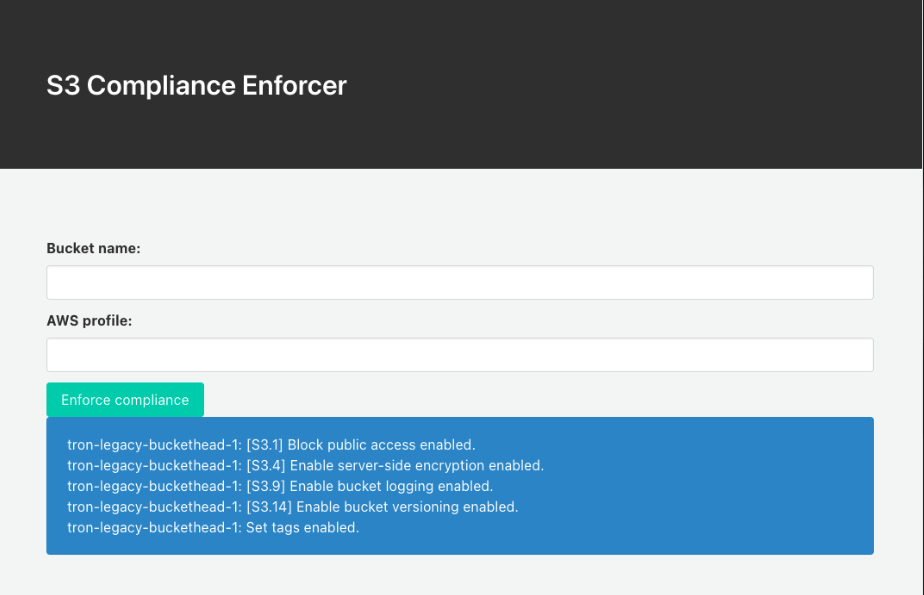
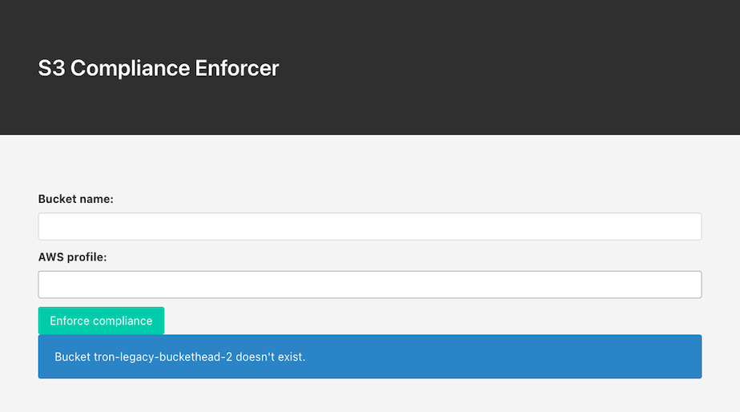

# Python Webapps

This code defines two routes: `/` for the main page and `/webapp_s3_bucket_comply.py` to handle the form submission.

When the user submits the form, the `webapp_s3_bucket_comply` function is called, which performs the S3 compliance checks and returns the results to the user.

The index function simply returns a template for the main page, which contains a form that allows the user to enter the bucket name and AWS profile name.

The `webapp_s3_bucket_comply` function gets the form data, sets up the boto3 client, performs the compliance checks, and returns the results to the user using a result template.

## Quick Start

Install dependencies and run:

```bash
pip install -r requirements.txt
python webapp_s3_bucket_comply.py
```

```
 * Serving Flask app 'webapp_s3_bucket_comply'
 * Debug mode: on
 * Running on http://127.0.0.1:5000
Press CTRL+C to quit
```

The app will be available at [http://localhost:5000](http://localhost:5000).

## Start Page

Enter your bucket name and the corresponding AWS config profile name:



Click on __Enforce compliance__

## Output Example



If the bucket name does not exist:


